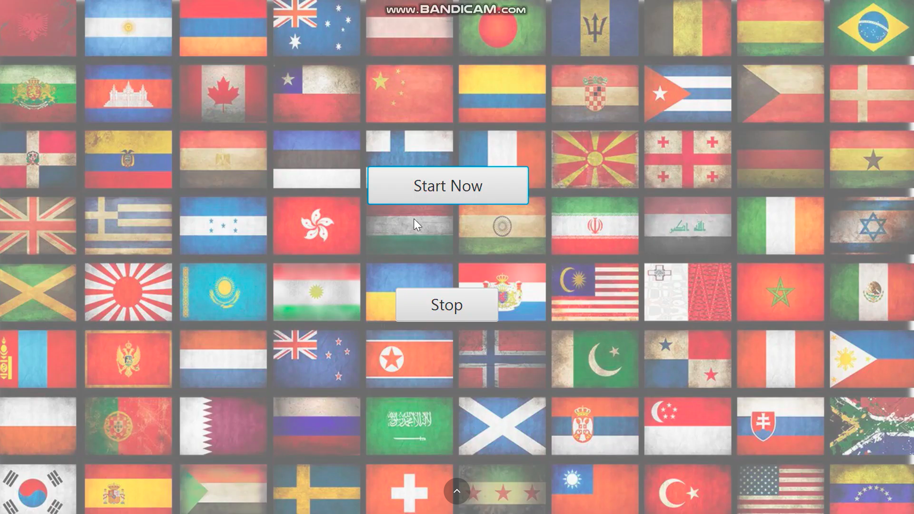

# 🚩 Flag Quiz — JavaFX  

## 📘 Overview  
**Flag Quiz** is an interactive **JavaFX-based quiz game** that challenges players to identify country flags from multiple-choice options.  
You’ll see a random flag and choose the correct country name from four answers — each correct guess earns you a score!  

This project was created as a **1-hour mini challenge**, showcasing UI design, event handling, and logic building using **JavaFX**.  

---

## 🎮 Features  
- **Multiple Choice Gameplay:** Choose the correct country flag from four options.  
- **Real-Time Scoring:** Updates dynamically as you answer questions.  
- **Question Counter:** Displays how many questions are left.  
- **Simple, Clean UI:** Built using FXML and styled with CSS.  
- **Extensive Flag Library:** Includes a wide variety of flag images for better gameplay.  

---

## 🛠️ Technologies Used  
- **Language:** Java (Java 17 or later)  
- **Framework:** JavaFX  
- **UI:** FXML + CSS  
- **Build Tool:** Maven  

---

## ⚙️ How to Run  

1. Install **Java 17** or higher.  
2. Clone this repository:
   ```bash
   git clone <repository-url>
   cd Flag-Quiz-JavaFX
   ```
3. Build the project:
   ```bash
   ./mvnw clean install
   ```
4. Run the application:
   ```bash
   ./mvnw javafx:run
   ```

When started, the game displays a random flag with four possible answers. Select the correct one to increase your score and test your flag knowledge!

---

## 🎥 Project Demonstration  
Watch the **Flag Quiz** gameplay video here:  

[](https://www.youtube.com/watch?v=gv25Fwjs)

**LinkedIn Post:**  
[View on LinkedIn](https://www.linkedin.com/posts/sksazid_flag-quiz-1-hour-project-using-javafx-activity-7154130581872672768-I36r?utm_source=share&utm_medium=member_desktop)  

---

## 🚀 Future Enhancements  
- Add timer-based scoring system.  
- Introduce multiple difficulty levels.  
- Implement sound effects for correct and wrong answers.  
- Save player high scores to a file or database.  
- Create region-specific quiz categories (e.g., Asia, Europe, Africa).  

---

## 👨‍💻 Developer  
**Developed by:** Md Ahasanul Haque Sazid  
**Department:** Computer Science and Engineering (CSE), SUST  

---

## 📄 License  
This project is created for **educational and demonstration purposes** only.  
© 2024 Md Ahasanul Haque Sazid. All rights reserved.  

---

✅ *A fun, fast, and educational JavaFX project built in just one hour!*  
